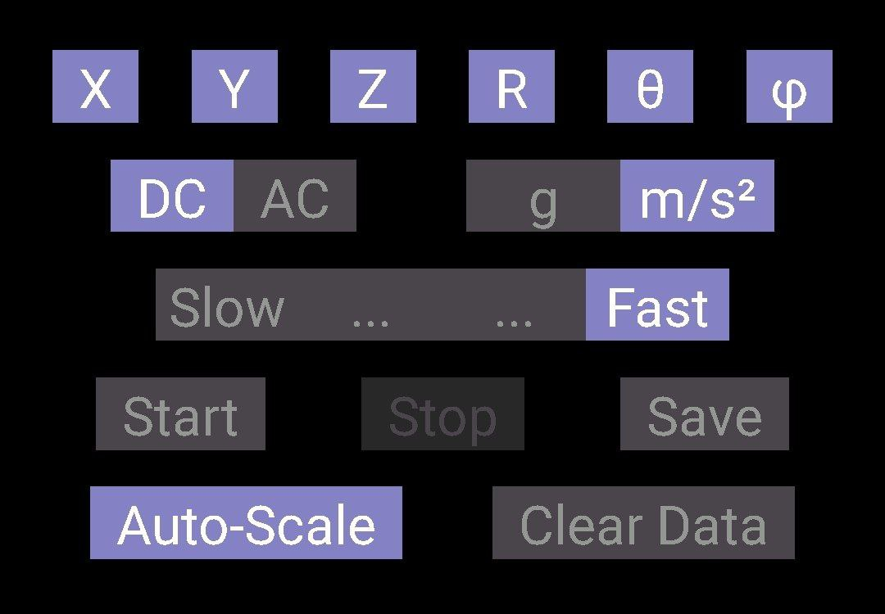

# Boxing_punches_classification
Boxing punches сlassification during a training fight using data science. Also, the resulting algorithm can be used to classify individual strokes.
## Contents

- [Formulation of the problem](#formulation-of-the-problem)
- [Contents of the repository](#contents-of-the-repository)
- [About the dataset](#about-the-dataset)

## Formulation of the problem
### Task:
Create a system that will highlight and classify the boxer's punches during training (training combat and individual punches).

For this purpose it is necessary to:

1) Come up with a system with which you will collect data
2) Collect dataset
3) Analyze the data obtained
4) Complete the data processing
5) Create a machine learning model that will highlight and classify punches
6) Test and analyze the results

**You can see the solution to all these tasks in my presentation (Rudchyk_Boxing_Punch_Classif_ENG)**. 

Later in the README we will talk about filling the repository (Contents of jupyter notebook and сollected dataset).
## Contents of the repository
Files:
- boxing_punches_classification_final.ipynb, This is a ready-made notebook that takes a recording file, then filters the data, looks for punches in the recording and classifies them.
- boxing_punches_classification_markup.ipynb, The file that contains dataset markup indexes.
- Rudchyk_Boxing_Punch_Classif_ENG.pptx, A presentation in which all stages of solving the problem are shown in detail.
- Rudchyk_Boxing_Punch_Classif_UA.pptx, Презентація, що зазначена вище, але на українській мові, можливо комусь буде набагато зручніше). Обережно, там немає декількох правок які були внесені в Англ варіант, тому краще орієнтуватись на нього.
- boxing_punches_classification_workbook.ipynb, This is my workbook, which records the process of data analysis, selection of filters, search for features for models, selection of models and arguments for their use. There are also graphs I looked at while working and the main thoughts I had. Unfortunately, since this is a workbook, it is not very cleanly designed(. P.S. It's not very interesting and informative, but it might help if you want to use the dataset I've collected.

Folders:
- data, The collected dataset is divided into 3 folders, test and training data for the punches classification model, and training fight records for the punches detection model.
- model, Models for classification and detection have already been trained. There are several punches classification models,CatBoost worked best on my test data.

## About the dataset
### Data collection
Data collection was performed with a phone (accelerometer + gyroscope) in the boxer's hand.
Position: in the hand, perpendicular to the fingers, the screen towards you, the camera towards the thumb.
The data was recorded using the Accelerometer Meter application (you can find it in Google Play) at the settings (in the Graph section) marked in the figure.

That is, the model uses sensor values in $m/s^{2}$ and with frequency of 200 Hz.

We have 9 (7+2 only test) professional fighters with a well placed punch in the data collection.

There are 2 types of records:
Systems of successive separate clean strokes of different speeds and made by different hands. It is the train + test data. A total of 33 recordings (550 punches).

A shadow fight in which boxers could move freely, use counters and parry, only 3 types of punches could be used. It is the fight data. A total of 15 recordings (12 min, 250 punches).

### Train data
The train record has the following format:
1. 5 seconds of rest
2. 5 jabs
3. 5 seconds of rest
4. 5 uppercuts
5. 5 seconds of rest
6. 5 hooks
7. 5 seconds of rest

After each punch there is a 2 second rest so that we can easily separate the punches.

The files include recordings of slow and fast punches, also recordings of left and right handed punches.

P.S. Several files have the format of 2-5 jabs, 10 uppercuts and 10 hooks. In such cases, see the markup file.

### Test data
The train record has the following format:
1. 5 seconds of rest
2. 2 jabs (slow + fast)
3. 5 seconds of rest
4. 2 uppercuts (slow + fast)
5. 5 seconds of rest
6. 2 hooks (slow + fast)
7. 5 seconds of rest

After each punch there is a 2 second rest so that we can easily separate the punches.

The files include recordings of left and right handed punches.

### Fight data

The fight record has a shadow fight in which boxers could move freely, use counters and parry, only 3 types of punches could be used. It was a really free and real shadow fight.

Boxers beat only with the hand that had the phone in it.

Since the boxer did not perform the exact exercise, the data was marked on video recordings.

